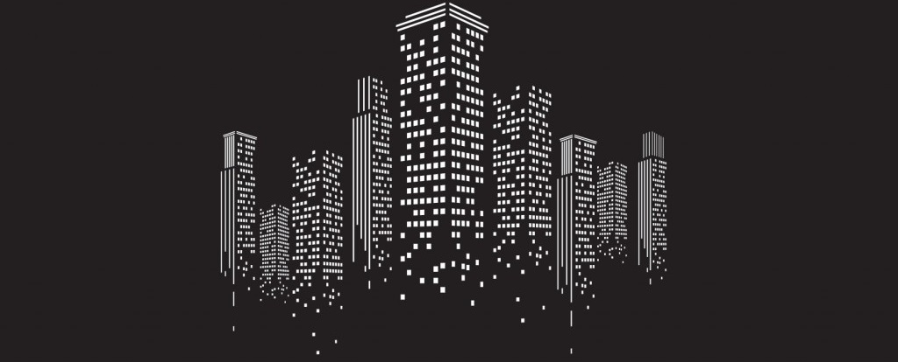

# Floyd-Hoare <small>2018/10/17</small>

Lo primero que veras al escuchar de Floy-Hoare es la lógica es la terna o triplete {**Q**} **S** {**R**}. Donde **Q** y **R** son predicados lógicos que deben cumplirse para que el programa **S** funcione.

# Referencias

- https://es.wikipedia.org/wiki/L%C3%B3gica_de_Hoare
- https://en.wikipedia.org/wiki/Hoare_logic
- https://es.wikipedia.org/wiki/Dise%C3%B1o_por_contrato
- https://es.wikipedia.org/wiki/Invariantes_de_clase
